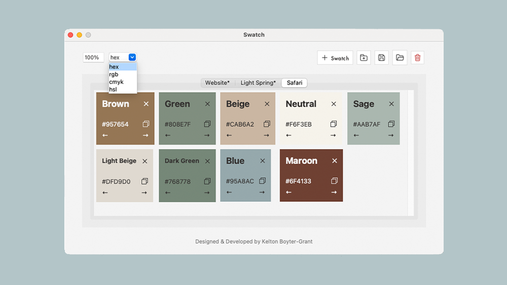
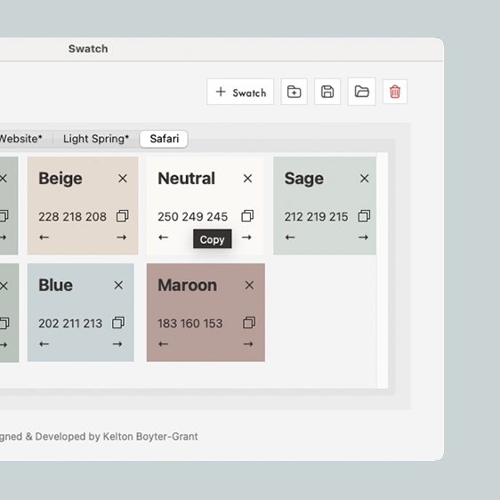
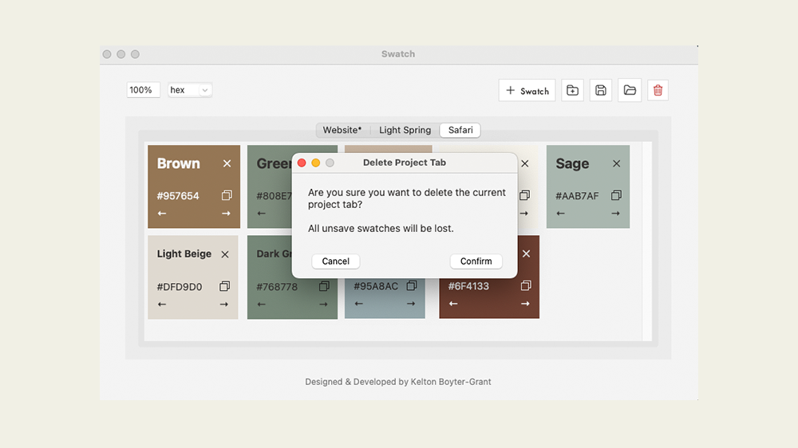
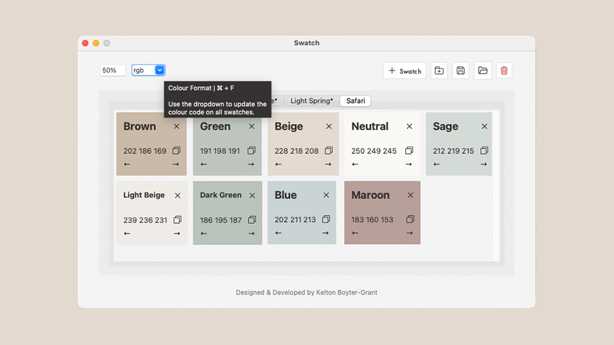
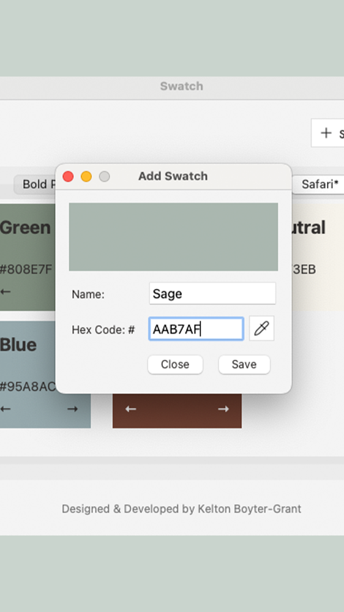
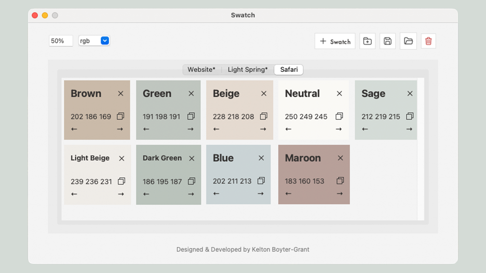

#  Swatch
Swatch is a lightweight Mac OS app that is for designers and creatives who want better management of their colour palettes across projects and software.
Swatch has a minimalistic user interface following industry best practices to help simplify your creative workflow and enable you to keep designing and not worrying
about hex codes.
# Overview
## Description
Swatch is a python application that uses tkinter to create a MacOS application for managing colour palettes and their digital codes.
This project has been developed after spending too much time trying to find hex codes, manage tint and shade variations, and maintaining palettes across multiple software.

In its simplist form, Swatch is a series of json files 

## Status
Complete

## Tech Stack

**Language:** Python 3.14

**Dependencies:**
- `Pillow` (10.1.0) - Image processing
- `json` (1.1.3) - JSON file reading and writing

**Standard Library:**
- `tkinter` - GUI framework
- `os` - File system operations
- `time` - Date handling

## Installation
### Requirements
- mss        == 10.2.0
- Pillow     == 12.3.0
- setuptools == 82.0.1

## Features
### Functionality
#### Project Tools
- `Open` - Load locally saved .Sw files into Swatch to view a Swatch project file.
- `Save` - Save the active project tab to a .Sw file to your local files.
- `Delete` - Close the active project tab that is open in Swatch.
- `New Project` - Create a new project tab for a new creative project. New swatches can be added to the project.
- `New Swatch` - Create a new swatch colour to the active project tab. Enter the colour's name and hex code (either by typing or using the eyedropper tool). This is how colour codes can be copied to the clipboard.

#### Colour Adjustment Tools
- `Update Colour Code Format` - Use the dropdown list to change the displayed colour code for each swatch. Supported formats are:
   - Hex
   - RGB
   - CMYK
   - HSL
- `Adjust Tint or Shade` - Update all colour codes to reflect tint and shade variations (by adding white or black to the original colour value). Entering a number from -95 to -1 will create a shade (adding black). Entering a number from 1-99 will create a tint (adding white). Enter either 100 or 0 to revert to the original colour value.

#### Swatch Card Tools
- `Delete` - Delete the swatch card from the corrosponding project that it is part of.
- `Rename` - Click the card's name to enter a new name for the card.
- `Copy Colour Code` - Click the card's background, colour value or copy icon to add the colour value to the clipboard.
- `Move` - Click the left or right arrow to move the card one position to the left or right in the grid of swatch cards.

### Shortcuts
| Key | Action |
|-----|--------|
| `⌘ + s` | Save project tab |
| `⌘ + d` | Delete project tab |
| `⌘ + o` | Open project tab files |
| `⌘ + p` | Create a new project tab |
| `⌘ + n` | Add a new swatch card to the active project |
| `⌘ + f` | Cycle through the colour code format options |

## Screenshots
Using the colour code format drop down.

Mouse hover hint text for copying.

Delete project popup.

Mouse hover hint text for colour formatting.

Adding a new swatch colour popup.

Tint adjustment for all colour swatch cards.

## Author
**Kelton Boyter-Grant**  

**AI Disclosure:**  
The use if artificial intelligence (AI) has been used to aid the development of this project. All AI code has been reviewed and approved by a human before integration with the the code base.
